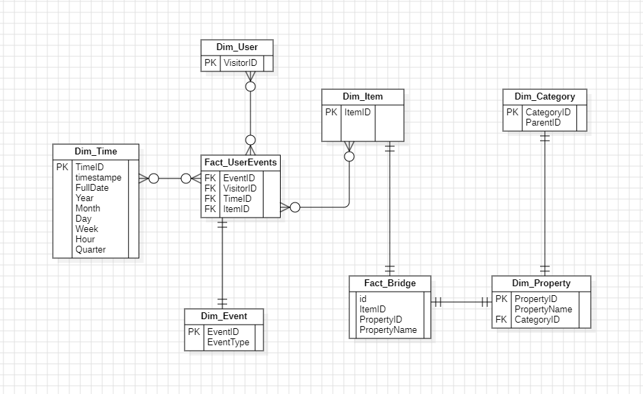

*2022级软件工程数据仓库大作业*
# 电商平台用户行为分析数据仓库
**项目简介**  
本项目基于 Retailrocket Recommender System Dataset 数据集，使用 SSIS、SSAS 和 SSRS 三个核心工具完成了**数据需求分析**、**建模设计**、**实现与可视化分析**的全流程。通过本项目，我们建立了一个离线数据仓库，对用户行为数据进行了整合与分析，最终通过报表与仪表盘提供可视化以提供决策支持。

---

**目录**  

[1. 项目背景](#项目背景)  
[2. 需求分析](#需求分析)  
[3. 设计阶段](#设计阶段)  
[4. 实现阶段](#实现阶段)  
[5. 项目成果](#项目成果)  

---

## 项目背景
本项目为厦门大学软件工程2022级数据仓库大作业，提出的初衷是因为在 OOAD 和 JaveEE 课程中是设计电商平台项目，所以选择电商用户行为分析方面，通过建立一个数据仓库，对用户的点击行为、购物车行为以及商品分类和时间维度进行整合分析，提供全面的用户行为洞察。

### 技术架构
1. SSIS(SQL Service Integration Services)：负责数据的提取、清洗、转换和加载；
2. SSAS(SQL Service Analysis Services)：负责多维数据建模与分析；
3. SSRS(SQL Service Reporting Services)：负责报表设计与可视化展示。

---

## 需求分析
### 目标：
1. 整合用户的行为数据，支持多维分析，如按照时间、商品、事件类型等维度统计用户行为；
2. 提供用户行为趋势、商品热度分析等决策支持；
3. 主要分析用户行为和商品、时间的关系。

### 关键需求：
1. 数据源：包含用户行为(event.csv)、商品属性(item_properties_part1.csv 和 item_properties_part2.csv)及商品分类(category_tree.csv)；
2. 分析目标：
    - 按照时间和分类分析用户浏览和购物车行为的分布；
    - 统计热销商品和关键行为；
3. 可视化需求：报表展示用户行为趋势、分类分析。

--- 

## 设计阶段
### 1. 概念设计
#### 1.1 概念设计
概念设计是数据仓库设计的第一步，主要关注业务需求的抽象，不涉及技术实现细节。在这一阶段：
- 确定需要从存储的数据主题和分析维度；
- 确定需要度量的指标（如销售额、事件次数）；
- 不关注表的字段名、数据类型或具体实现。

#### 1.2 本项目中的概念设计
在本项目中，我们根据数据集的分析需求（用户行为分析）设计以下数据主题和维度：
- 事实表（主题）
  - 用户行为事件(Fact_UserEvents)：记录用户在电商平台的行为（浏览、加入购物车等），作为分析的核心主题；
  - 商品桥接表(Fact_Bridge)：用来处理商品维度和商品属性维度的多对多。
- 维度表（分析维度）
  - 用户维度(Dim_User)
  - 商品维度(Dim_Item)
  - 商品属性维度表(Dim_Property)
  - 时间维度(Dim_Time)
  - 类别维度(Dim_Category)

#### 1.3 设计思路
抓住关键核心主题：什么用户在什么时候对什么商品做了什么行为。

### 2. 逻辑设计
#### 2.1 逻辑设计
逻辑设计是将概念设计转化为技术实现的模型，开始引入表的结构，但仍然与具体数据库的实现无关。在这一阶段：
- 确定表结构：哪些属于哪张表；
- 定义主键和外键关系；
- 选择数据仓库建模方式（星型模型还是雪花模型）。

#### 2.2 本项目的逻辑设计
我们采用了雪花模型，定义了一下表结构及其关系：

**维度表**

1. Dim_User（用户维度）：
   - 字段：
     - VisitorID(PK)：用户唯一标识。
2. Dim_Item（商品维度）：
   - 字段：
     - ItemID(PK)：商品唯一标识；。
3. Dim_Category（类别维度表）：
   - 字段：
     - CategoryID(FK)
     - ParentCategoryID
4. Dim_Time（时间维度）：
   - 字段：
     - TimeID(PK)：时间戳的唯一标识；
     - Year、Month、Day、Quarter：时间的层次结构。
   - 作用：支持按照年、月、日、季度等维度分析行为。
5. Dim_Property（商品属性维度表）：
   - 字段：
     - PropertyID(PK)
     - PropertyName：属性名
     - CategoryID：本来是不打算要的，但是数据集里面有这个表，就还是留下来了。

**事实表**

1. Fact_UserEvents（用户行为事实表）：
   - 字段：
     - EventID(PK)：辅助主键；
     - VisitorID(FK)：用户维度外键；
     - ItemID(FK)：商品维度外键；
     - TimeID(FK)：时间维度外键；
     - EventType（行为类型，只有三种，比较少，所以没有额外建维度表）
     - TransactionID：（交易ID，可以为空）
   - 作用：记录用户行为的所有核心数据，用于计算行为趋势、比例等。
2. Fact_bridge（商品属性多对多桥接表）：
   - 字段：
     - BridgeID(FK);
     - ItemID(FK);
     - PropertyID(FK);
     - PropertyValue(属性值);

雪花模型是一种数据库设计模型，它在星型模型的基础上，对维度表进一步归一化，从而形成复杂的层次结构。事实表仍然是中心表，但维度表之间可以存在关联，用于支持多级分类或多层次属性。

雪花模型的核心特点，而不是问题。我们来详细分析：
1. 维度表之间的关系（例如 Dim_Item 和 Dim_Category）：
   1. 商品（Dim_Item）有一个 CategoryID，关联商品类别（Dim_Category）。
   2. 类别表（Dim_Category）通过自关联（ParentCategoryID）形成层次结构。
   3. 这种设计的目的是支持更灵活的查询，如按分类层次进行统计或分析。
2. 维度表的扩展（例如 Dim_Property）：
   1. 商品属性（Dim_Property）不是直接挂在事实表上，而是作为独立维度表。
   2. 属性值存储在 Fact_ItemProperties 中，关联到属性表和商品表。
   3. 这种设计方便动态扩展商品属性，不需要频繁修改事实表的结构。
3. 雪花模型的定义允许维度表之间存在关系：
   1. 在雪花模型中，维度表可以进一步归一化，减少冗余数据，提高维护性。比如：
      1. Dim_Item 和 Dim_Category 是商品和分类的层次关系。
      2. Dim_Property 是商品属性的扩展维度，与 Dim_Item 相关联。
4. 事实表的中心性：
   1. Fact_UserEvents 是用户行为的核心事实表，连接了用户（Dim_User）、时间（Dim_Time）、商品（Dim_Item）和行为类型。

尽管维度表之间有关系，但在查询和分析时，最终的目标仍然是围绕事实表展开分析。

**附录**

#### 2.3 设计思路
- 维度划分清晰：
  - 将用户、商品、时间和事件独立建表，便于数据更新和扩展；
  - 通过主键和外键构建数据间的关系，避免数据冗余。
- 采用雪花模型：
  - 雪花模型可以支持更复杂的维度层次（如商品分类ID），适合 category_tree 表的结构。
- 事实表关联所有维度：
  - 确保可以从多个角度分析用户行为（如按照时间统计商品的浏览次数、按事件类型区分行为比例等）。

### 3. 物理设计
#### 3.1 物理设计
物理设计是将逻辑设计转化为具体的数据库实现，考虑实际的存储、性能和索引。包括：
- 确定字段的数据类型；
- 定义索引和分区以优化查询性能；
- 考虑数据库特性（如主键约束、外键约束）。

#### 3.2 本项目中的物理设计
在 SSMS(SQL Server Management Services) 中实现上述表结构，通过 SSMS 的方式从创建的，

---

## 实现阶段
Retailrocket Recommender System Dataset是在kaggle上寻找到的数据集，在分析时发现种种问题，详情见[数据预处理](./finalwork/dataset/dataProcess.ipynb)。
### 1. 数据库创建（SSMS）
详情请见[数据库代码](/finalwork/doc/warhouse.sql)  

还有一点很重要的是设置用户权限，在我实际操作过程中SSAS的用户没有在数据库中注册，所以需要在SSMS中创建对应的用户，并且给与相应的权限。

### 1. ETL流程（SSIS）
涉及到三种类型csv文件数据提取，但是在进行操作之前，我还是认为先用简单的python代码进行一下预先处理，所以用python写出另外一个新的表格property，这个表格里面就已经有propertyId、propertyName内容。

### 控制流视图

其中category是提取Dim_Category，property用来处理Dim_Property，Items是Dim_Items和桥接表，event是Dim_Users, Dim_Time, Fact_UserBehavior。后两者因为数据量太大，所以切分成很多小文件，一个文件内存放了5w条数据，用循环进行导入。

### Category

这个其实很简单，不需要做过多的数据处理，因为数据集内容少、数据类型也都是INT型，允许有 null 值就可以了。

### Property

因为要利用 Category，所以这里的逻辑是如果 PropertyName == categoryid 时，去查找相对应的，然后在这里用外键联系起来。

### Items And Bridge

- Items很简单只有一个id，导入进来用聚合去重就可以了；
- 桥接表主要就是为了处理一个itemid有多个property值而产生的，先将三个特征值都去重，再通过查找 Property 表中，判断哪些property 值相等，再将对应的 propertyId导入进该表中，构成itemid和propertyid的联合。这里设计propertyid的原因是因为property数据量庞大，并且同一个itemid还会有不同的property，所以通过中间桥接来完成这一部分数据库的构建。

### Others
最后一个循环涉及三个维度表和一个事实表的创建。  

- userId只需要直接去重提取就好了；
- Event也是创建一个子增加的主键来记录事件；
- Time这个表稍微有些麻烦，因为源数据中给的数据类型连数据库时间戳都不能读取，查阅到是unix时间戳之类的，这里直接当成String类型导入，然后转成INT8（本来以为不够大的）再用派生列一个个新增更细致的时间划分即可。
- 最后的事实表因为全是外键，所以一直查找相关内容，找到后点击添加，最后存进表里面就可以了。

### 问题
在构建SSIS途中遇到的最大的问题就是这个缓冲区大小处理问题了，数据量很庞大，很多次我电脑的内存都是差0.n G就要跑满了；并且查找会产生大量ache缓存，进一步拖慢了运行时间，甚至造成很多数据丢失。我尝试将一部分缓存设置为部分缓存，但是会出现相关报错，也没有再去研究了。

### 2. 数据建模与分析（SSAS）
相较于SSIS中漫长的调整数据结构、缓冲区大小、数据类型对应等，SSAS的工作就方便了很多，直接按部就班创建数据源、数据视图、多维数据集然后调整维度就可以了。

数据源图

多维数据集图

最后把自己想要分析的维度内容加入进去，部署完就可以了。

### 问题
其实在实际操作中遇到很多问题，但是一直反复删除创建、删除创建，最后就莫名其妙可以正常部署了。。。

### 3. 可视化分析（SSRS）
在SSAS部署成功后，使用SSRS进行项目可视化部分。按照我们的预先设想，大致分为以下几类：
1. 个体用户在不同时间对不同商品的互动分析（event）；

2. 某种商品在不同时间下火热程度；

3. 商品属性分析

4. 用户行为分析：

5. 分析用户消费频率，筛选优质客户。

根据上面的图，我们可以分析到：
- 对于用户个体来说，我们可以分析出用户不同时间经常访问的商品；
- 对于商品来说，我们分析了哪些商品是热销的，哪些是吸引用户的，并且可以分析出商品随时间的热度；
- 对于商家，可以分析优质商品，以及不同时间上架不同商品，并且可以分析到哪些是优质客户，经常消费。

## 项目成果
见doc下演示视频。
<video src="finalwork/doc/演示视频.mp4" controls width="640"></video>